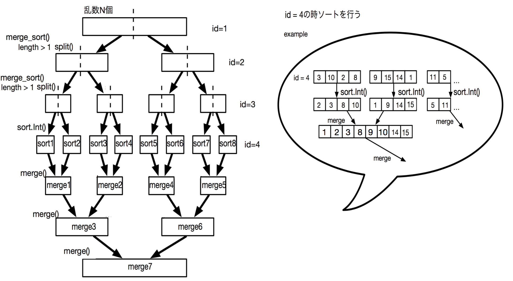
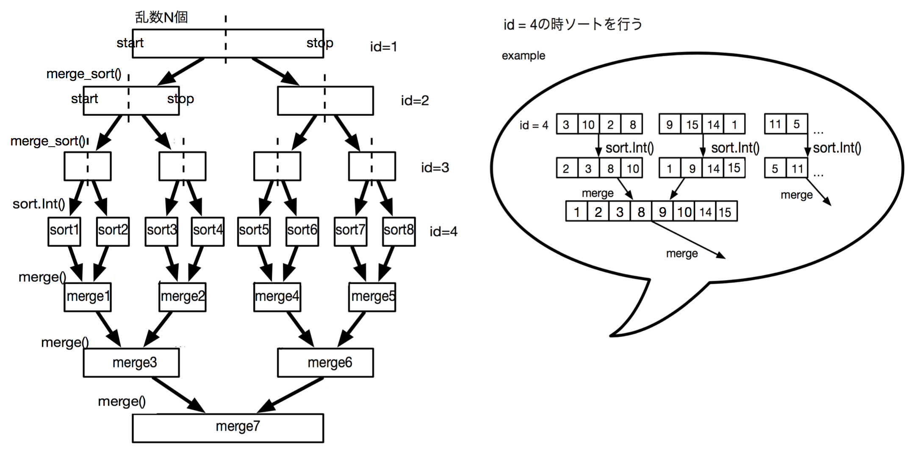
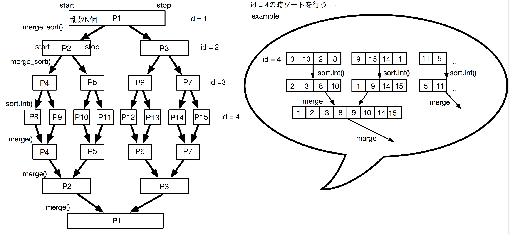
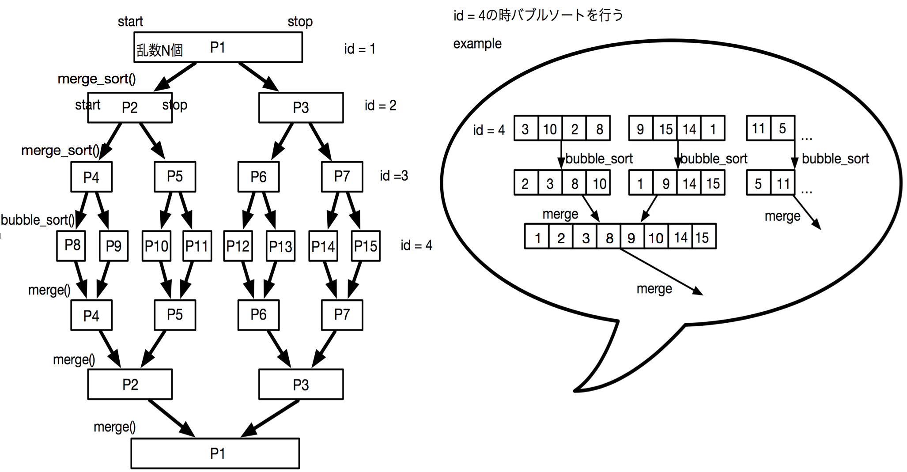
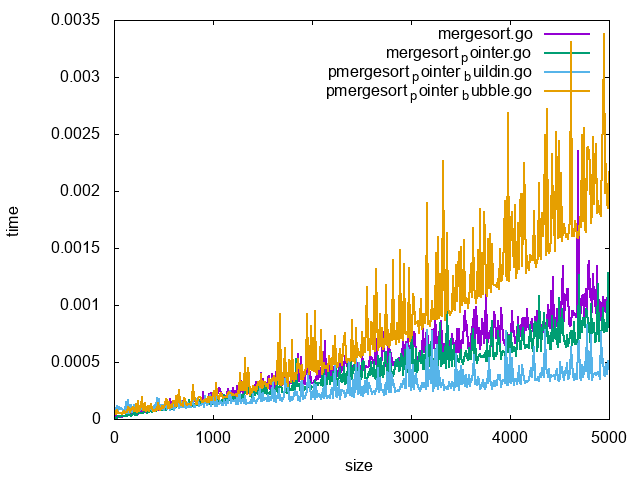
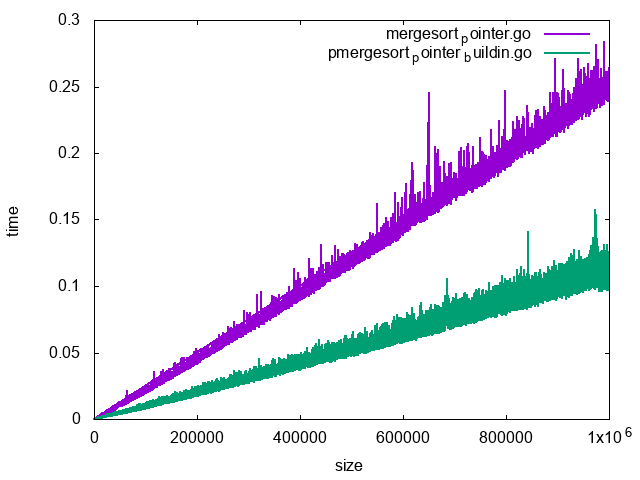
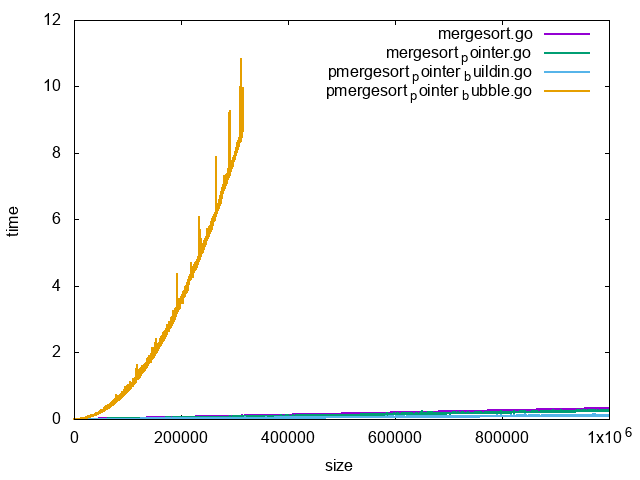

# 目的

　go言語による並列化の実装及び考察を行う.

# 方法

　マージソートを主とした逐次, 並列化双方のプログラムを用意し, 実行速度を比較する. 他にも, マージソートプログラムに他のソートを組み合わせたプログラムの効用についても調査を行う. 

# 実験内容

　今回用意したプログラムは以下の4つである.

<table>
  <tr>
    <td>逐次プログラム</td>
    <td>並列化プログラム</td>
  </tr>
  <tr>
    <td>mergesort.go</td>
    <td>pmergesort_pointer_buildin.go</td>
  </tr>
  <tr>
    <td>mergesort_pointer.go</td>
    <td>pmergesort_pointer_bubble.go</td>
  </tr>
</table>


# プログラムの概要

・mergesort.go

　元にしたマージソートプログラム. ソート部分にはbuildin関数sort.Int()を用いている. 



図1. mergesort.goイメージ

・mergesort_pointer.go

　mergesort.goの並列化を試みたが実行速度に向上が見られなかったため, golangは変数宣言によるオーバーヘッドが大きくなるという理由により, ポインタを追加した. 



　図2. mergedort_pointer.go

・pmergesort_pointer_buildin.go

　mergesort_pointer.goを並列化させたプログラム. golangは処理の完了を取るためのsyncパッケージをimportし, goroutineを使用することで並列化が可能である. 

　----goroutine----------------------

　　　go func(){

//並列化させたい処理

}

　--------------------------------------

当プログラムはmerge_sort()でgoroutineを使用している. 



図3. pmergesort_pointer_buildin.goイメージ

・pmergesort_pointer_bubble.go

　mergesort_pointer.goを並列化させ, ソート部分のみバブルソートに変更してみた. 



図4. pmerge_pointer_bubble.goイメージ

# 実行結果



図5. 速度比較

表1.実行速度の順位

<table>
  <tr>
    <td></td>
    <td>コード名</td>
    <td>処理速度</td>
  </tr>
  <tr>
    <td>1</td>
    <td>pmergesort_pointer_buildin.go</td>
    <td>0.000441</td>
  </tr>
  <tr>
    <td>2</td>
    <td>mergesort_pointer.go</td>
    <td>0.000810</td>
  </tr>
  <tr>
    <td>3</td>
    <td>mergesort.go</td>
    <td>0.000961</td>
  </tr>
  <tr>
    <td>4</td>
    <td>mergesort_pointer_bubble.go</td>
    <td>0.002163</td>
  </tr>
</table>


実行速度は上記の順で速かった. 



図6. 逐次と並列化プログラムの速度比較

　逐次と並列化プログラムの速度を比較すると, 並列化プログラムの方が速くなっていることが分かる.

# 実行速度の考察

## 1.pmergesort_pointer_buildin.goについて．

　マージソートがデータをそれ以上分けられないようにするのに対しpmergesort_pointer_buildin.goは，データの分割をスレッド数までに行い，データにbuildin関数のsort関数を用いている．

　go言語のbuildin関数であるsort関数は,適宜速いソーティングアルゴリズムをクイックソート, ヒープソート, 挿入ソート の中から選択して実行する関数である．そのため，純正のマージソートよりも実行時間が短いと考えられる．

## 2.mergesort_pointer.goについて.

　go言語で端末のcpuコア数を表示するスクリプトtest.goを作成し、実行環境のコア数を見た結果，コア数4だった．コア数が4では並列処理をしても，変数宣言などの，ロード/ストアがオーバーヘッドとなり，実行時間が速くならないという事例が確認されている(参考文献1).

　そのため，pointerを用いることで，ロード/ストアのオーバーヘッドを軽減することによって，実行時間を速くする試みにより，実行結果が早くなったと考えられる．

## コア数を見るスクリプト test.go

```

    fmt.Println("利用できる CPU のコア数",runtime.NumCPU()) //利用できる CPU のコア数

    fmt.Println("使用するコア数",runtime.GOMAXPROCS(0)) //使用するコア数

    fmt.Println("現存している goroutine の数",runtime.NumGoroutine()) //現存している goroutine の数

```

## 上記test.goの実行結果

```

利用できる CPU のコア数 4

使用するコア数 4

現存している goroutine の数 1

```

CPUコア数は4であると確認できる．

## 4.pmergesort_pointer_bubble.goについて

　pmergesort_pointer_bubble.goは，バブルソートを並列で実行しているため，

　bubbleソートは最悪計算量O(n^2)のアルゴリズムである．扱う数が増えれば増えるほど，実行時間は指数関数的に増大する．



図7. バブルソートの様子

# 実行環境

メモリ 8 GB 1600 MHz DDR3

CPU 2.6 GHz Intel Core i5

MacBook Pro (Retina, 13-inch, Mid 2014)

# 参考文献

1.マルチコアCPU上の並列化手法、その並列性能と問題点[https://www.softek.co.jp/SPG/Pgi/TIPS/public/general/multicore-para.html](https://www.softek.co.jp/SPG/Pgi/TIPS/public/general/multicore-para.html)

